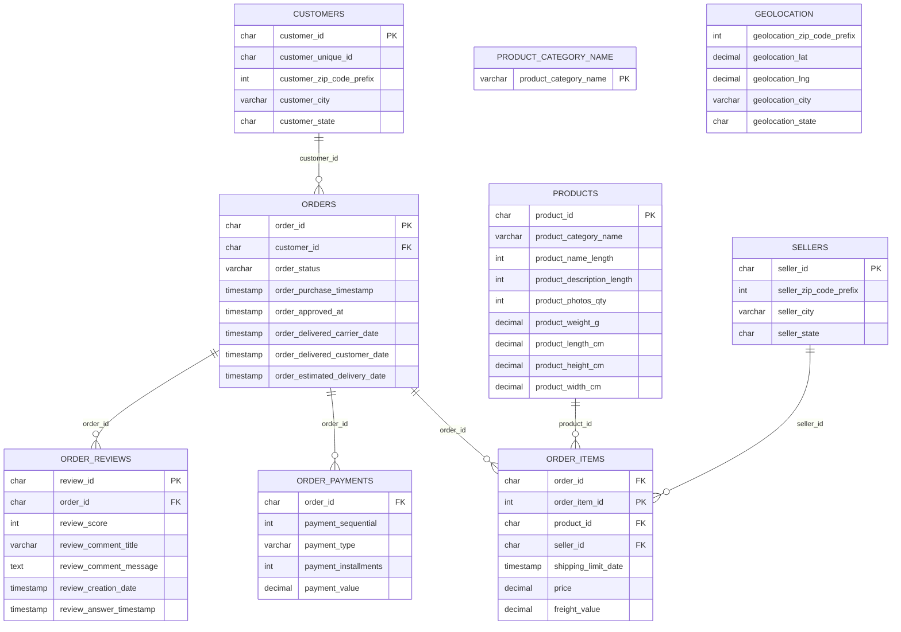

# E-Commerce-Sales-Analytics

## Overview

This project is an end-to-end SQL analysis of the Olist Brazilian E-commerce dataset using PostgreSQL to uncover insights into customer behavior, sales performance, payments, reviews, and delivery operations.
The project follows a structured analytics workflow, beginning with database exploration and data quality assessment before moving into exploratory data analysis (EDA) and business-driven insights. The goal is to demonstrate practical SQL skills by analyzing real-world e-commerce data and communicating actionable findings.

## Project Status

## Current Progress

- [x] Repository Created
- [x] Load Data
- [x] Data Exploration
- [x] Data Quality Assessment
- [x] Exploratory Data Analysis
- [] Advanced Analysis
- [] Visualizations

## Business Task

The Olist store is an e-commerce business headquartered in Sao Paulo, Brazil. The business task is to analyze the e-commerce dataset to understand how the business is performing across sales, customers, products, payments, and customer satisfaction. The analysis aims to identify important patterns in the business and use those findings to determine which areas require deeper analysis and could provide actionable insights.

## Tools

- Postgresql
- Power BI
- Git

## Data Exploration

This project uses the **Brazilian Olist E-commerce Dataset**, obtained from Kaggle. The dataset was originally provided as multitple CSV files. For this project the data was imported into a PostgreSQL relational database for analysis.
The database consists of 9 tables representing different aspects of an e-commerce platform, including customers, orders, products, sellers, payments, geolocation and review.

- **customers** stores customer identifiers and location information. It contains 99441 rows.
- **geolocation** contains geographical information, including zip code prefixes, longitude and latitude. It contains 1000163 rows.
- **orders** records customer orders and key timestamps throughout the order lifecycle such as purchase, approval, delivery and estimated delivery date. It contains 99441 rows.
- **order_item** contains details of each product within an order, including the seller, shipping deadline and price. It contains 112650 rows.
- **order_payments** stores payment information, including payment method, number of installments and payment value.It contains 103886 rows.
- **order_reviews** contains customer reviews and review scores associated with completed orders.It contains 99224 rows.
- **products** provides descriptive information about each product, such as its category and physical characteristics.It contains 32951 rows.
- **product_category_name_translation** maps Portugese product category names to their English equivalents.It contains 71 rows.
- **sellers** stores seller identifiers and location information. It contains 3095 rows.

I verified the data integrity by ensuring all datasets have consistent columns and each column has the correct type of data

## Database Schema & Relationships

## Data Quality Assesment

1. I checked for duplicates in each table. No duplicates where found in the customer, order_items, order_payments, order_reviews, orders, products, sellers, product_category_name_translation table

2. The products table contains two category values that are not present in the product_category_name lookup table. Because no foreign key constraint exists between these tables, the inconsistency is not prevented by the dabase schema

3. In the order_review table, the review_comment_title and review_comment_message columns contains a high proportion of missing values. However, these fields are optional free text comments, while the numerical review_score is still present for most reviews. Therefore no row removal was performed

4. There are missing timestamp values in the orders table but looking closely at the data, the order lifecycle showed that missing values are expected. Orders status such as created, processing, invoiced, shipped, cancelled and unavilable naturally lack one or more delivery-related timestamp. A very small number of orders marked as delivered contain missing timestamps, since these record represent less than 0.02% of delivered orders, they were retained in the dataset. However, they will be excluded from analysis that requie complete delivery timestamp information

5. The product table contains 611 records with missing values. Most of these records lack descriptive product metadata, while two records have missing physical dimensions. Since the missing values cannot be reliably inferred, the original data was preserved. Records with missing values wll be exculed only from analyses that require those specific attributes

## Exploratory Data Analysis

### Observations

**1. Geographic distribution of customers and sellers**

Most customers and sellers are located in **São Paulo (SP)**, indicating a strong concentration of marketplace activity in the state. **Acre (AC)** and **Amazonas (AM)** are among the five states with the fewest customers.

* **Question to investigate:** How does geographic customer concentration relate to order volume and payment value?

**2. Payment value over the dataset period**

The dataset covers approximately **2 years, 1 month, and 12 days** of order activity, with a total payment value of **$16,008,872.12**.

* **Question to investigate:** How did sales/payment value change over the period covered by the dataset?

**3. Product category and customer satisfaction**

**CDs, DVDs & Musicals (`cds_dvds_musicais`)** has the highest average review score among the product categories examined.

* **Question to investigate:** Which product categories combine strong sales performance with high customer satisfaction?

**4. Payment and purchasing behavior**

**Credit cards** account for the largest number of orders and contribute substantially to the total payment value.

* **Question to investigate:** How does payment behavior differ across customers and orders?

**5. Delivery performance and customer satisfaction**

The order data contains timestamps for different stages of the purchasing and delivery process, providing an opportunity to investigate the relationship between delivery performance and customer satisfaction.

* **Question to investigate:** Does longer delivery time correspond to lower customer review scores?

### Summary Table

## Recommendations

## Certificate

This project was completed as a capstone project after completing the [Data Analytics Associate Certification](https://www.datacamp.com/certificate/DAA0011187698277) on DataCamp.

--- 
*Feel free to explore the files above, and reach out via [LinkedIn](https://www.linkedin.com/in/emeka-osakwe) if you have any questions or feedback!*
